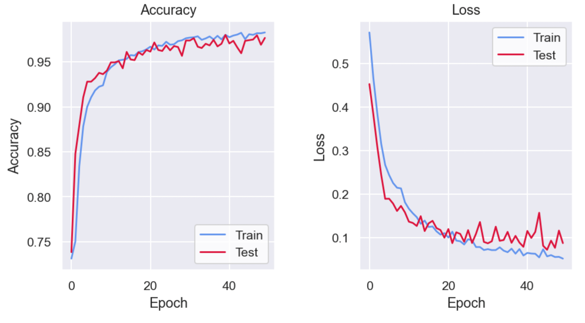

# Covid-X-ray-Image-Classification-using-CNN
### ENCH 470 Final Project 
Convolutional Neural Network (CNN) model for COVID-19 detection based on X-ray image classification. 

CNN model is implemented in Keras, which is an open-source software that acts as an interface for the TensorFlow library in python for deep-learning.

The main code for building the model and generate the dataset is in the model_functions.py file.  
The model_visuals.py have the custom settings for the plots used in the Jupyter notebook.

### Dataset:
The dataset used is from Kaggle [COVID-19 radiography database](https://www.kaggle.com/tawsifurrahman/covid19-radiography-database).

### Model architecture:
The model used is:

### Results:
The learning curves are:

